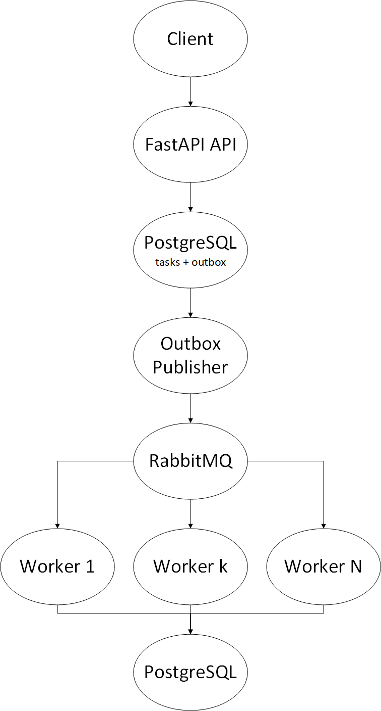

# async_task-service_by_FastAPI
Тестовое задание на Python с использованием FastAPI

Асинхронный сервис управдения задачами на Python, FastAPI, RabbitMQ, SQLAlchemy и Alembic.

## Требования к задаче:
### Функциональные требования:
* Создание задач через REST API
* Асинхронная обработка задач в фоновом режиме
* Возможность параллельной обработки нескольких задач
* Система приоритетов для задач

### Технические требования:
* Язык программирования: Python 3.10+
* База данных: PostgreSQL 14+
* Очередь сообщений: RabbitMQ
* Framework: FastAPI
* ORM: SQLAlchemy
* Система миграций БД: Alembic
* API документация: OpenAPI/Swagger

## Архитектура


### Почему Outbox

Создание задачи и запись события в `outbox_events` выполняются в одной транзакции PostgreSQL. Поэтому сценарий "задача записалась в БД, но сообщение потерялось между commit и RabbitMQ" не приводит к потере задачи. Publisher повторяет публикацию необработанных outbox-событий.

RabbitMQ используется с durable queue и persistent messages. Worker использует manual acknowledgement через `message.process(requeue=True)`.

## Запуск

```bash
cp .env.example .env
docker compose up --build -d
docker compose exec api alembic upgrade head
```

Swagger: http://localhost:8000/docs  
RabbitMQ UI: http://localhost:15672

## API

### Создание

```bash
curl -X POST http://localhost:8000/api/v1/tasks \
  -H "Content-Type: application/json" \
  -d '{"title":"Generate report","description":"Demo task","priority":"HIGH"}'
```

### Список

```bash
curl "http://localhost:8000/api/v1/tasks?status=COMPLETED&priority=HIGH&limit=20&offset=0"
```

### Получение

```bash
curl http://localhost:8000/api/v1/tasks/<UUID>
```

### Статус

```bash
curl http://localhost:8000/api/v1/tasks/<UUID>/status
```

### Отмена

```bash
curl -X DELETE http://localhost:8000/api/v1/tasks/<UUID>
```

## Масштабирование

Worker stateless относительно очереди и может масштабироваться горизонтально:

```bash
docker compose up --scale worker=5
```

Количество одновременно обрабатываемых сообщений ограничивается `RABBITMQ_PREFETCH`. Для производительности можно отдельно масштабировать API и workers.

## Отказоустойчивость

- PostgreSQL хранит источник истины о состоянии задачи.
- Transactional Outbox предотвращает потерю события после успешного создания задачи.
- RabbitMQ durable queue + persistent messages.
- `connect_robust()` автоматически восстанавливает AMQP connection.
- Worker подтверждает сообщение только после получения/обработки.
- Conditional state transition защищает от повторной обработки одной задачи.
- API не выполняет тяжелую работу синхронно.

## Важное ограничение

Текущий worker содержит демонстрационный `TaskProcessor`.

## Тесты

```bash
pytest -q
```
